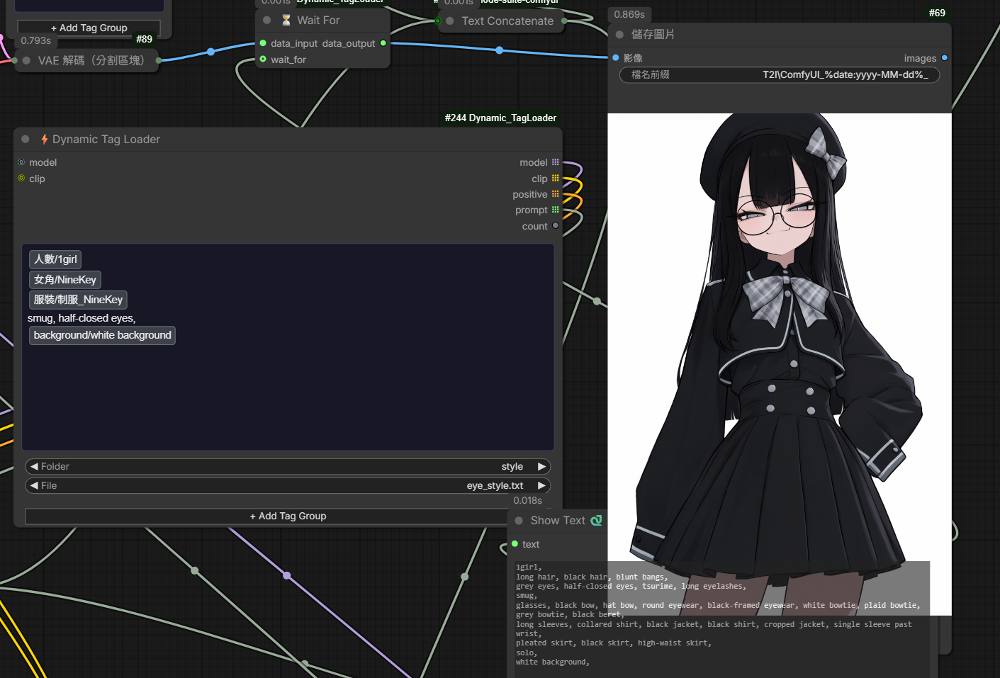
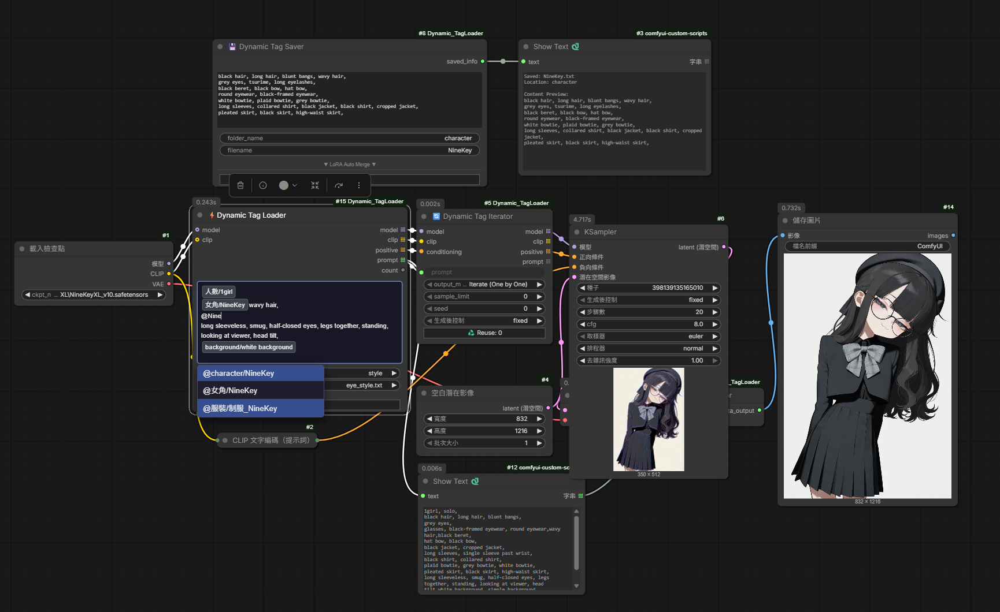
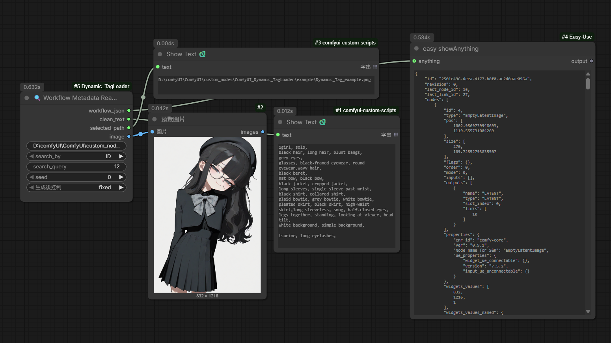

<h1 align="center">
    ComfyUI_Dynamic_TagLoader
</h1>

## 🔗 Quick Links

* [English Version](./README_en.md)
* [日本語版](./README_jp.md)
* [中文版](./README.md)


## 方塊式 Prompt 編輯



在 ⚡ Dynamic Tag Loader 的 Prompt 編輯區輸入 `@`，即可搜尋並插入 tag `.txt` 檔。插入後會以方塊顯示，可與一般文字自由混排；點選方塊後可用 `Ctrl + ↑ / ↓` 依 ComfyUI 原生規則調整強度，並可用 Backspace、Delete、複製與貼上快速編輯。

## 安裝說明 (Installation)

進入 ComfyUI custom_nodes 目錄：

```bash
cd ComfyUI/custom_nodes/
git clone https://github.com/NineKey1028/ComfyUI_Dynamic_TagLoader.git

```

重新啟動 ComfyUI。

### ⚡Dynamic Tag Loader
> 快速的讀取、排序 tag 資料夾中整理好的 .txt 文件，同時支持 LoRa 讀取，與 🔄 Dynamic Tag Iterator 連接後可支持 prompt 隨機、批量輸出
> <details>
>    <summary><i>更多...</i></summary>
>
>    * **Global Prompt**：輸出時會處於所有組合的第一行。
>    * **\+ Add Tag Group**：點擊新增讀取的資料夾，可依需求添加無數個組合。
>    * **Tag Group**：
>      * **Folder**：目前讀取的資料夾，點擊可打開資料夾選單切換資料夾。
>      * **File**：目前資料夾下所讀取的檔案，選擇第一行 ALL 選項時會將此資料夾中所有的 .txt 與其它組的 .txt 進行組合排序並全部輸出。
>    * **LoRA 讀取**：支援在 .txt 檔案或 Global Prompt 中直接編寫 <lora:lora_name:權重>。節點會自動提取語法、加載模型權重，並從最終輸出的提示詞中清理該語法。
>    * **右鍵選單**：在任一 Tag Group 區塊點擊右鍵，可呼叫專屬選單進行「上移/下移」、「置頂/置底」、「向前/向後插入新組」或「刪除該組」等排序操作。
>    </details>

### 🔄 Dynamic Tag Iterator
> 接收來自 Dynamic Tag Loader 的組合列表，並根據設定進行單次迭代或批量輸出。
> <details>
>    <summary><i>更多...</i></summary>
>
>    * **Output Mode**：
>        * **Iterate (One by One)**：配合 ComfyUI 的隊列機制，每次執行僅輸出組合中的一項（依據 Seed 進行索引順序切換）。
>        * **Batch (List)**：一次性輸出所有組合（或篩選後的列表），適用於支持 List 處理的後續節點。
>    * **Sample Limit**：抽樣限制功能。設為 0 時使用所有組合；若大於 0，則會根據目前的 Seed 從所有組合中隨機抽取指定數量的項進行輸出。
>    * **Seed 控制與記錄**：
>        * 節點會根據輸入的 Seed 決定迭代的索引或隨機抽樣的順序。
>        * **♻️ Reuse Last Seed**：UI 面板會自動記錄上一次成功執行時使用的 Seed。點擊按鈕可快速將該數值填回 Seed 輸入框，方便復現特定的隨機組合。
>    </details>

### 💾 Dynamic Tag Saver
> 將 Prompt 文本即時保存為 .txt 標籤檔案，並自動整合所選的 LoRA 語法。此節點能幫助使用者快速建立個人標籤庫，方便未來透過 Dynamic Tag Loader 重新讀取與組合。
> <details>
>    <summary><i>更多...</i></summary>
>
>    * **Text Input**：主要的提示詞輸入區塊。存檔時會自動移除前後多餘空格。
>    * **Folder & Filename**：
>        * **Folder Name**：指定存檔的資料夾名稱，若目錄不存在會自動創建（位於節點目錄下的 `tags` 資料夾中）。
>        * **Filename**：指定檔案名稱。若資料夾內已存在同名檔案，會自動添加流水號（如 `_1`, `_2`），防止覆蓋既有資料。
>    * **LoRA Auto Merge (▼ LoRA Auto Merge ▼)**：
>        * **+ Add LoRA**：點擊開啟搜尋選單，從系統中選擇安裝好的 LoRA 檔案。
>        * **Strength**：調整該 LoRA 的權重數值（支援 -10.0 至 10.0）。
>        * **自動語法整合**：存檔時，節點會將選擇的 LoRA 自動轉換為標準 Prompt 語法 `<lora:名稱:權重>` 並附加在文本末端。
>    * **右鍵進階選單**：在 LoRA 區塊點擊右鍵，可進行「置頂/置底」、「排序移動」或「插入/刪除」等操作，靈活調整 LoRA 的寫入順序。
>    </details>

### 🔍 Workflow Metadata Reader
> 用於從生成的圖片（PNG）中回溯提取完整的 Workflow JSON 數據與並依工作流ID抓取內容並輸出prompt、圖片。支持單圖解析、資料夾批量隨機選取。
> <details>
>    <summary><i>更多...</i></summary>
>
>    * **image_or_dir**：可輸入圖片或資料夾路徑。
>    * **Search By**：
>        * **ID**：透過節點 ID 定位並提取該節點的所有 Widget 數值（如 Prompt、Seed 等）。
>        * **Type**：透過節點類型（如 `CLIPTextEncode`）過濾並提取匹配的文本內容。
>    * **檔案選取邏輯**：
>        * **資料夾模式**：輸入資料夾路徑，並配合 **Seed** 進行隨機索引抽樣，適合用於自動化重新讀取不同圖片的提示詞。
>        * **單圖模式**：直接讀取指定路徑的圖片資訊。
>
>    可直接將圖片檔案拖入節點並填寫圖片路徑。
>
>    可從剪貼簿直接 `Ctrl+V` 貼上圖片。
> 
>    上敘兩項動作會將圖片複製至input資料夾
> 
>    ⚠️ **注意事項**：
>    正確讀取 Prompt 的前提是該流程中需使用類似 **Show Text** 的節點來顯示提示詞，且 **Prompt 必須先於圖片產生**（即寫入 Metadata 中），否則可能會讀取到錯誤資訊。若遇到執行順序問題，建議搭配 **⏳ Wait For** 節點來強制控制產生順序。
>    </details>

### ⏳ Wait For
> 用於強制控制工作流的執行順序。在 ComfyUI 的非線性執行環境中，確保特定節點必須在「目標節點」完成後才開始運算，解決異步執行導致的順序錯誤問題。
> <details>
>    <summary><i>更多...</i></summary>
>
>    * **Data Input**：主要流轉的數據（支援任何類型 AnyType），此數據將被原樣輸出。
>    * **Wait For (Optional)**：連接你希望先執行的節點輸出。當此連接點有數據傳入時，`Wait For` 才會釋放 `Data Input` 給後續節點。
>    </details>

範例工作流：


可拖入 comfyUI 讀取範例工作流
