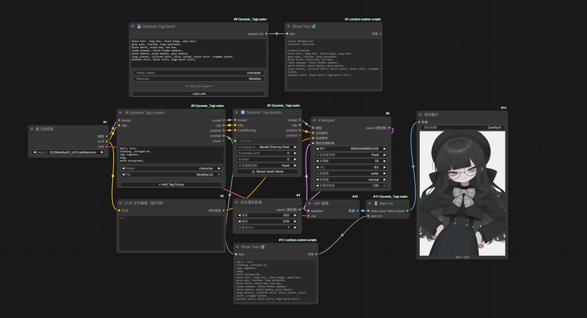
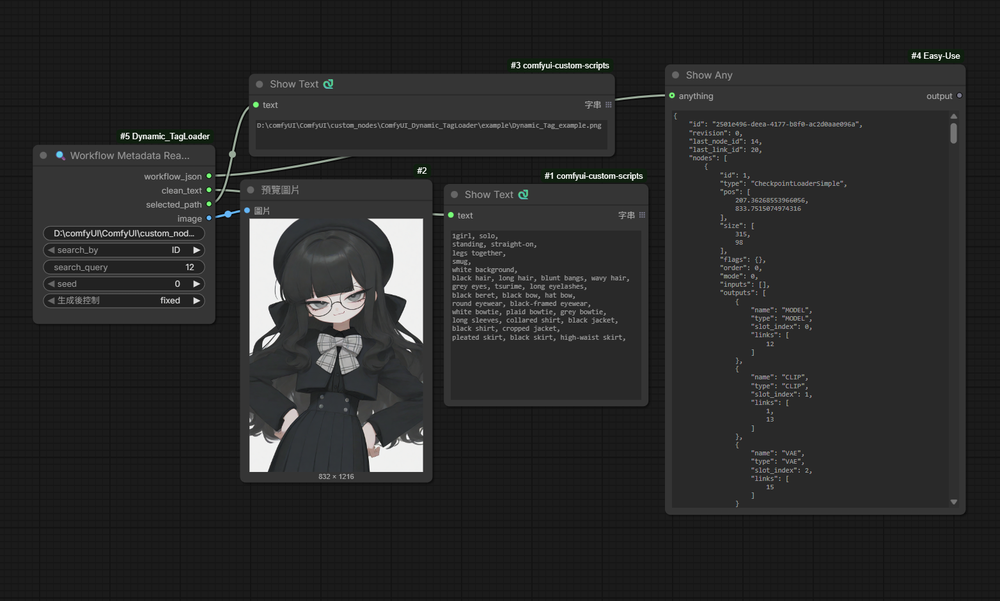

<h1 align="center">
    ComfyUI_Dynamic_TagLoader
</h1>

## 🔗 Quick Links

* [English Version](./README_en.md)
* [日本語版](./README_jp.md)
* [中文版](./README.md)


## インストール

ComfyUI の `custom_nodes` ディレクトリに移動します：

```bash
cd ComfyUI/custom_nodes/
git clone https://github.com/NineKey1028/ComfyUI_Dynamic_TagLoader.git

```

ComfyUI を再起動してください。

### ⚡ Dynamic Tag Loader
> 整理されたタグフォルダから `.txt` ファイルを高速に読み込み、ソートします。LoRA の読み込みにも対応しており、🔄 **Dynamic Tag Iterator** と接続することで、プロンプトのランダム化やバッチ出力が可能です。
> <details>
> <summary><i>詳細...</i></summary>

> * **Global Prompt**: すべての組み合わせの先頭に出力されます。
> * **+ Add Tag Group**: クリックして読み込むフォルダを追加します。必要に応じて無制限に追加可能です。
> * **Tag Group**:
> * **Folder**: 現在読み込んでいるフォルダ。クリックしてフォルダを切り替えられます。
> * **File**: 現在のフォルダ内で読み込まれているファイル。「ALL」を選択すると、このフォルダ内のすべての `.txt` が他のグループのファイルと組み合わされ、全パターンが出力されます。
> 
> 
> * **LoRA 読み込み**: `.txt` ファイルまたは Global Prompt 内に `<lora:lora_name:weight>` を直接記述できます。ノードが自動的に構文を抽出してモデルウェイトをロードし、最終的なプロンプトからは構文を削除します。
> * **右クリックメニュー**: Tag Group 領域を右クリックして、「上へ/下へ移動」、「最上部/最下部へ」、「新しいグループを挿入」、「削除」などの操作が可能です。
>    </details>

### 🔄 Dynamic Tag Iterator
> Dynamic Tag Loader から組み合わせリストを受け取り、設定に基づいて単一のイテレーションまたはバッチ出力を行います。
> <details>
> <summary><i>詳細...</i></summary>

> * **Output Mode**:
> * **Iterate (One by One)**: ComfyUI のキュー機能と連動し、実行ごとに組み合わせを1つずつ出力します（Seed に基づいて順序を切り替え）。
> * **Batch (List)**: すべての組み合わせ（またはフィルタリング後のリスト）を一度に出力します。リスト処理に対応したノードに最適です。
> 
> 
> * **Sample Limit**: サンプリング制限機能。0 の場合はすべての組み合わせを使用します。0 より大きい場合、現在の Seed に基づいて指定された数だけランダムに抽出します。
> * **Seed コントロールと記録**:
> * Seed によってイテレーションのインデックスやランダムサンプリングの順序が決定されます。
> * **♻️ Reuse Last Seed**: 直前の成功した実行で使用された Seed を自動記録します。ボタンをクリックして Seed 入力欄に値を戻し、特定の組み合わせを再現できます。
>    </details>

### 💾 Dynamic Tag Saver
> プロンプトテキストを即座に `.txt` タグファイルとして保存し、選択した LoRA 構文を自動的に統合します。個人用のタグライブラリを構築し、将来的に Dynamic Tag Loader で再利用するのに便利です。
> <details>
> <summary><i>詳細...</i></summary>

> * **Text Input**: メインのプロンプト入力エリア。保存時に前後の不要な空白を自動削除します。
> * **Folder & Filename**:
> * **Folder Name**: 保存先フォルダ名。存在しない場合は自動生成されます（ノードディレクトリ内の `tags` フォルダ内）。
> * **Filename**: ファイル名。同名ファイルがある場合は自動で連番（`_1`, `_2`）が付与されます。
> 
> 
> * **LoRA Auto Merge**:
> * **+ Add LoRA**: クリックしてインストール済みの LoRA ファイルを検索・選択します。
> * **Strength**: ウェイト値を調整します（-10.0 ～ 10.0 対応）。
> * **自動構文統合**: 保存時、選択した LoRA は標準のプロンプト構文 `<lora:名称:ウェイト>` に変換され、テキストの末尾に追加されます。
> 
> 
> * **右クリックメニュー**: LoRA ブロックを右クリックして、順序の変更や削除が可能です。
>    </details>

### 🔍 Workflow Metadata Reader
> 生成された画像（PNG）から完全な Workflow JSON データを抽出します。ノード ID に基づいてプロンプトや画像を取得し、単一画像の解析やフォルダからのランダム選択に対応しています。
> <details>
> <summary><i>詳細...</i></summary>

> * **image_or_dir**: 画像ファイルまたはフォルダのパスを入力します。
> * **Search By**:
> * **ID**: ノード ID を通じて、そのノードの全ウィジェット値（プロンプト、Seed など）を抽出します。
> * **Type**: ノードタイプ（例: `CLIPTextEncode`）を指定してテキスト内容を抽出します。
> 
> 
> * **画像選択ロジック**:
> * **フォルダモード**: フォルダパスを入力し、**Seed** を利用してランダムに画像をサンプリングします。
> * **単一画像モード**: 指定した画像の情報を直接読み込みます。
> 
> 
> * **ヒント**: 画像をノードにドラッグ＆ドロップするか `Ctrl+V` で貼り付けることができます（`input` フォルダにコピーされます）。
> ⚠️ **注意**: プロンプトを正しく読み込むには、ワークフロー内で **Show Text** のようなノードを使用し、画像生成前にプロンプトがメタデータに書き込まれている必要があります。順序の問題が発生する場合は **⏳ Wait For** ノードを使用してください。
>    </details>

### ⏳ Wait For
> ComfyUI の非線形実行環境で実行順序を強制制御します。特定のノードが完了してから次の計算を開始するように調整し、非同期実行によるエラーを防ぎます。
> <details>
> <summary><i>詳細...</i></summary>

> * **Data Input**: 次に渡すメインデータ（AnyType 対応）。そのまま出力されます。
> * **Wait For (Optional)**: 先に実行を完了させたいノードの出力を接続します。この接続点にデータが届くまで、`Data Input` は次へ放出されません。
> </details>

ワークフローの例：


これらの画像を ComfyUI にドラッグ＆ドロップすることで、サンプルワークフローを読み込むことができます。